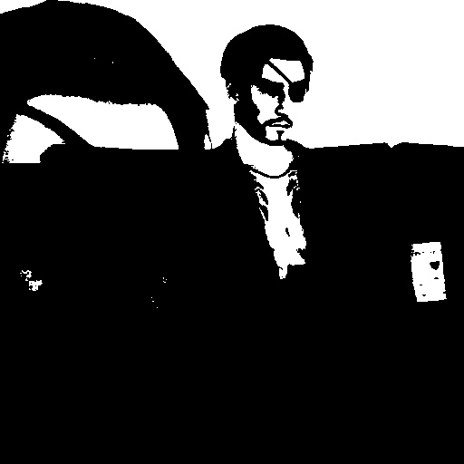
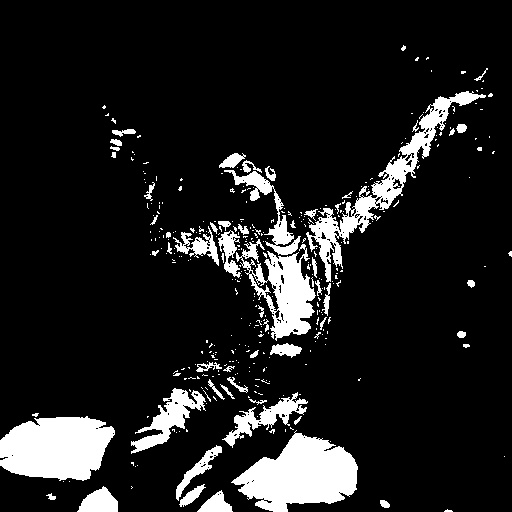
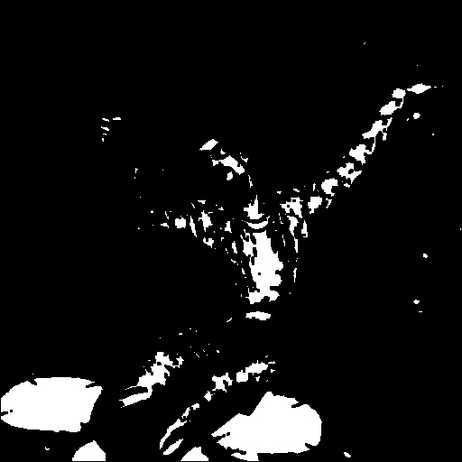

# Лабораторная работа №1

## Вариант 12
Эрозия. Задан примитив размера 3 на 3. На вход поступает изображение,
программа отрисовывает окно, в которое выводится либо исходное
изображение после бинаризации, либо после эрозии (переключение по
нажатию клавиши). Базовый алгоритм - эрозия.

## Цель работы
Научиться реализовывать один из простых алгоритмов обработки
изображений.

## Задание
  1. Реализовать программу согласно варианту задания. Базовый алгоритм, используемый в программе, необходимо реализовать в 3 вариантах: с использованием встроенных функций какой-либо библиотеки (OpenCV, PIL и др.) и нативно на Python + |с использованием Numba или C++|.
  2. Сравнить быстродействие реализованных вариантов.
  3. Сделать отчёт в виде readme на GitHub, там же должен быть выложен исходный код.

## Реализации:
  1. LR_1 библиотека OpenCV 
  2. LR_2 нативно на Python
  3. LR_3 Numba
 
## Приимер выполнения программы:
Бинеризация

Эрозия

 
## Сравнение времени выполнения реализации алгоритма:

| Реализация алгоритма   | t, с  | 
|------------------------|:-----:|
|Библиотека OpenCV       | 0.0009|  
|Алгоритм эрозия         | 5.4992| 
|Алгоритм эрозия с Numba | 3.0346| 

## Вывод;
В результате работы был реализован фильтр эррозия и проведено сравниние различных реализаций.
